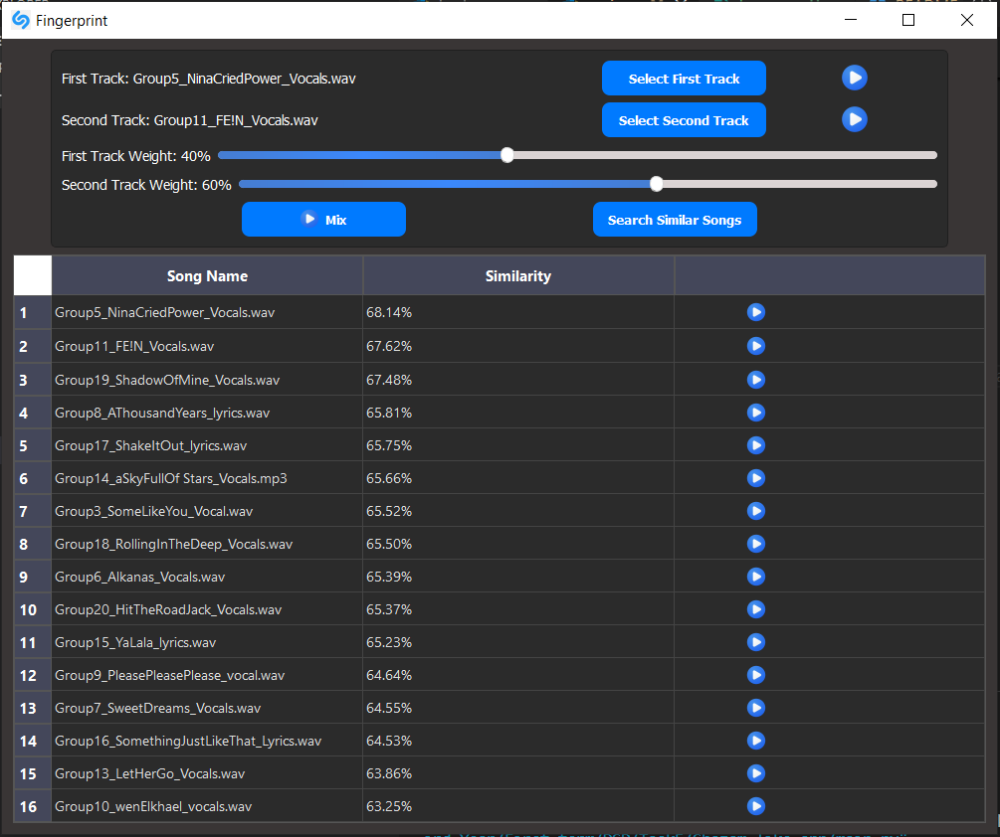

# Fingerprint (Shazam-like App)

## **Project Overview**

This project implements a fingerprinting system, inspired by Shazam, to identify and classify audio signals based on intrinsic features extracted from short audio samples. The application can identify songs, vocals, or music tracks from a shared repository by generating fingerprints for each track and matching new inputs against the repository. Additionally, it supports combining two tracks and analyzing their similarity with existing tracks in the repository.

---

## **Applications**
- **Music Industry**: Identifying songs, singers, or tunes from audio samples.
- **Medical Diagnosis**: Analyzing audio signals like ECG signals to identify anomalies (e.g., arrhythmias).

---

## **Features**

1. **Spectrogram Generation**:
   - Generate spectrograms for:
     - Full track
     - Music
     - Vocals
   - Spectrograms are generated for the first 30 seconds of each file.

3. **Feature Extraction**:
   - Extract key features from the spectrogram using researched methods.
   - Collect and save features in a structured file.

4. **Perceptual Hashing**:
   - Utilize perceptual hash functions to create concise fingerprints from extracted features.

5. **Similarity Matching**:
   - Identify the closest matches for any given input file (song, vocals, or music) from the repository.
   - Provide a similarity index and display results in a ranked list within the GUI.

6. **Audio Blending**:
   - Combine two audio files with a slider to control weighting percentages.
   - Treat the blended result as a new input and perform similarity analysis.

---

